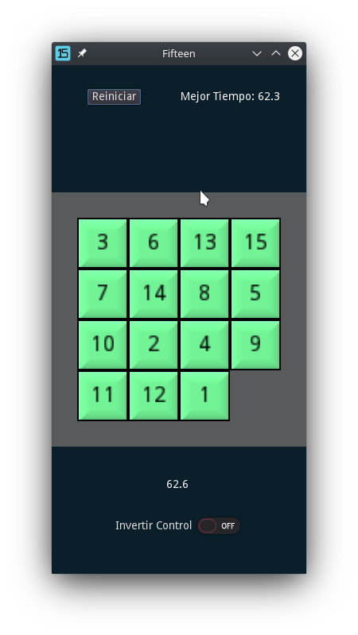
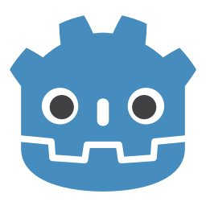
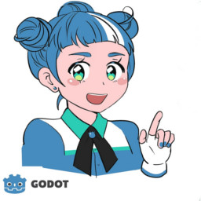

# Fifteen

Versión del puzzle hecha en Godot 3.1

 _

## Recursos 

Este proyecto utiliza imágenes creadas por Andrea Calabró bajo licencias Creative Commons Attribution License version 3.0 [CC-BY 3.0](https://creativecommons.org/licenses/by/3.0/legalcode)

Godot Logo

 _

Godette

 _

## Licencia 

Este proyecto está bajo la Licencia (MIT) - mira el archivo [LICENSE](LICENSE) para detalles

